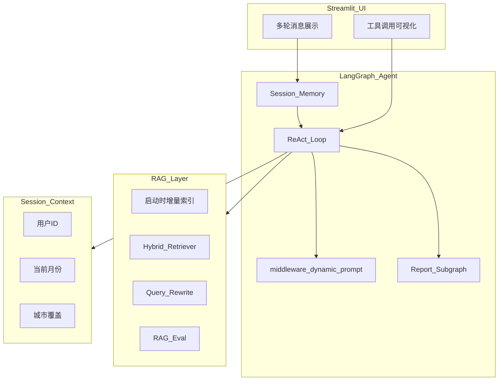

# 扫地机器人智能客服

基于 LangChain + LangGraph + Chroma 的垂直领域 RAG-ReAct 智能客服 Agent，面向扫地/扫拖机器人选购、故障、保养等场景。支持多轮对话记忆、Runtime Context 工具注入、混合检索、RAG 评估与报告生成子图。

## 项目亮点（简历可写）

- **ReAct 工具编排**：7+ 工具闭环（RAG、天气、定位、用户数据、报告子图）
- **LangGraph Middleware**：`@dynamic_prompt` 按场景切换系统/报告 Prompt
- **多轮记忆**：滑动窗口（最近 10 轮）传入 Agent，支持上下文追问
- **Session Context 注入**：`user_id` / `current_month` / `city` 通过 Runtime Context 传入工具，替代随机 Mock
- **混合检索 RAG**：向量 + BM25 混合检索，Query 改写，Hit@3 **100%**（18 条评测集）
- **报告生成子图**：LangGraph StateGraph 固化 SOP（拉取数据 → 生成报告）
- **可观测 UI**：Streamlit 展示工具调用链路（思考过程 Expander）

## 架构



## 环境要求

- Python **3.10+**（推荐 **3.11** 或 **3.12**）
- 阿里云 DashScope API Key（通义千问 + 向量嵌入）

## 快速开始

### 1. 进入项目目录

```powershell
cd "d:\AiAgent\agent_sweeping_robot"
```

### 2. 创建虚拟环境

```powershell
python -m venv .venv
.\.venv\Scripts\Activate.ps1
python -m pip install -U pip
pip install -r requirements.txt
```

### 3. 配置 API Key

```powershell
copy .env.example .env
```

编辑 `.env`，填入 `DASHSCOPE_API_KEY=sk-xxxxxxxx`。

### 4. 启动应用

```powershell
streamlit run app.py
```

若出现 `Fatal error in launcher`（项目从旧目录迁移后 `.venv` 内路径失效），改用：

```powershell
python -m streamlit run app.py
```

应用启动时会**自动检测并增量索引** `data/` 下的知识库文件（基于 MD5 去重）。浏览器访问 `http://localhost:8501`。

> 若向量库异常，删除 `chroma_db/` 和 `md5.text` 后重启应用即可自动重建。

## 命令行测试

```powershell
# 测试 Agent
python -m agent.react_agent

# 测试 RAG 检索与总结
python -m rag.rag_service

# 手动重建知识库索引
python -m rag.vector_store

# 运行 RAG 评估（生成 eval/report.md）
python -m eval.rag_eval
```

## RAG 评估结果

基于 18 条人工标注问答对（`eval/dataset.jsonl`），评估指标如下：

| 指标 | 结果 |
|------|------|
| Retrieval Hit@3 | **100.0%** |
| Answer Faithfulness | **100.0%** |

完整明细见 [eval/report.md](eval/report.md)。

## 面试 Demo 脚本

### 场景 1：多轮追问（考察记忆）

1. 「小户型适合哪些扫地机器人？」
2. 「那噪音大吗？」（Agent 应结合上一轮上下文回答）

### 场景 2：工具链（考察 ReAct 编排）

「我在深圳，今天适合扫地吗？」

预期工具链：`get_user_location` / 城市上下文 → `get_weather` → `rag_summarize`（湿度/清洁建议）

### 场景 3：报告生成（考察子图 + 动态 Prompt）

侧边栏选择用户 ID `1001`，输入：「帮我生成使用报告」

预期：调用 `generate_usage_report` 子图，输出 Markdown 格式个性化报告。

## 项目结构

```
├── app.py                      # Streamlit 入口（多轮记忆 + 工具链路可视化）
├── agent/
│   ├── react_agent.py          # ReAct Agent（滑动窗口 + Context 注入）
│   ├── report_subgraph.py      # 报告生成 LangGraph 子图
│   └── tools/
│       ├── agent_tools.py      # 工具定义（Runtime Context）
│       └── middleware.py       # 工具监控 + 动态 Prompt
├── rag/
│   ├── vector_store.py         # Chroma + Hybrid 检索 + 增量索引
│   └── rag_service.py          # Query 改写 + RAG 总结链
├── eval/
│   ├── dataset.jsonl           # 评估数据集（18 条）
│   ├── rag_eval.py             # Hit@3 + Faithfulness 评估
│   └── report.md               # 评估报告
├── config/                     # YAML 配置
├── prompts/                    # 系统 / RAG / 报告 Prompt
├── data/                       # 知识库 + 用户报告 CSV
└── utils/                      # 配置、日志、外部数据加载
```

## 配置说明

| 文件 | 说明 |
|------|------|
| `config/rag.yml` | 对话模型 `qwen3-max`，嵌入模型 `text-embedding-v4` |
| `config/chroma.yml` | 向量库、分片、混合检索、Query 改写开关 |
| `config/agent.yml` | 外部 CSV 数据路径 |
| `config/prompts.yml` | Prompt 模板路径 |

`config/chroma.yml` 关键项：

- `enable_hybrid_search`: 开启向量 + BM25 混合检索
- `enable_query_rewrite`: 开启 Query 改写
- `hybrid_k` / `hybrid_weights`: 混合检索参数

## 简历项目描述（参考）

> 扫地机器人 — 垂直领域 RAG-ReAct 智能客服。基于 LangGraph 实现工具编排与 `@dynamic_prompt` 场景切换；支持多轮记忆、Runtime Context 注入、混合检索 + RAG 评估（Hit@3 100%）；集成天气/定位/用户报告等多工具链路，Streamlit 可视化 ReAct 执行过程。

## 常见问题

### IP 定位不准确

侧边栏手动填写城市，或在 `.env` 配置 `AMAP_API_KEY`。

### API 认证失败

检查 `DASHSCOPE_API_KEY` 是否正确配置。

### 向量库需要重建

```powershell
Remove-Item -Recurse -Force chroma_db
Remove-Item -Force md5.text
streamlit run app.py
```

## 技术栈

- **LLM**：阿里云通义千问（DashScope）
- **Agent 框架**：LangChain + LangGraph（Middleware、子图）
- **向量数据库**：Chroma
- **检索**：向量 + BM25 混合检索（`rank-bm25`）
- **Web 界面**：Streamlit
- **外部 API**：Open-Meteo（天气）、多源 IP 定位
